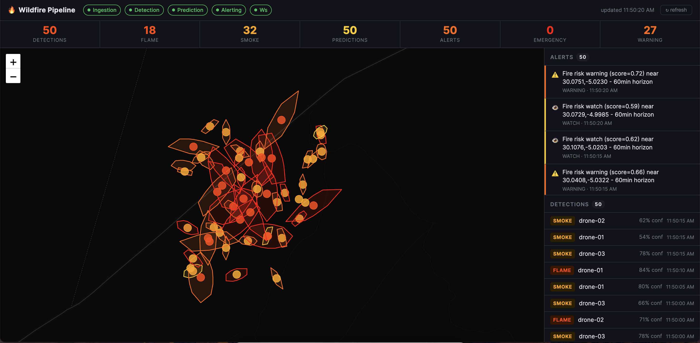

# Wildfire Detection Pipeline



An event-driven pipeline for drone/sensor-based wildfire detection, prediction, and alerting. Four FastAPI microservices communicate exclusively through a message bus (NATS JetStream by default, Kafka optional). A React dashboard consumes their outputs in real time. All events are persisted to Postgres.

```
                 HTTP                    NATS / Kafka subjects
  drones/sensors ──► [ingestion] ──► drones.telemetry ──┐
                                  └─► drones.frames    ──┼──► [detection] ──► fire.detections ──► [prediction] ──► fire.predictions ──► [alerting] ──► fire.alerts
                                                          │                                            ▲
                                                          └────────────────────────────────────────────┘
                                                            (telemetry feeds prediction as wind proxy)

  [dashboard] ──► WebSocket /ws/alerts  (real-time push)
              └─► HTTP /api/*           (5s poll — detections, predictions)
              both proxied by nginx — no CORS needed
```

## Services

| Service      | Port | Consumes                               | Publishes                           | Implementation                              |
|--------------|------|----------------------------------------|-------------------------------------|---------------------------------------------|
| `ingestion`  | 8001 | HTTP `POST /telemetry`, `POST /frames` | `drones.telemetry`, `drones.frames` | Pure ingress, no model                      |
| `detection`  | 8002 | `drones.frames`                        | `fire.detections`                   | `ModelBackend` — ONNX or deterministic stub |
| `prediction` | 8003 | `fire.detections`, `drones.telemetry`  | `fire.predictions`                  | Rothermel wind-driven ellipse spread model  |
| `alerting`   | 8004 | `fire.predictions`                     | `fire.alerts`                       | Rule-based severity + WebSocket broadcast   |
| `dashboard`  | 3000 | `/api/*` + `ws://.../ws/alerts`        | —                                   | React + Leaflet, nginx-proxied              |

## Infrastructure

| Container  | Purpose                                      | Port(s)        |
|------------|----------------------------------------------|----------------|
| `nats`     | Message bus (JetStream)                      | 4222, 8222     |
| `postgres` | Event persistence                            | 5432           |
| `kafka`    | Alternative transport (`--profile kafka`)    | 9092           |

## Quick start

```bash
make up          # docker compose up --build (NATS + Postgres + 4 services + dashboard)
```

Open the dashboard: **http://localhost:3000**

Drive the pipeline with simulated drones:

```bash
pip install httpx
make simulate    # 3 drones send telemetry + frames every 3s; Ctrl-C to stop
```

Inspect raw data:

```bash
curl localhost:8002/detections | jq
curl localhost:8003/predictions | jq
curl localhost:8004/alerts | jq
make logs        # tail all service logs
```

## Dashboard

Live at **http://localhost:3000**:

- **Health bar** — per-service status pills + `ws` WebSocket indicator, last-updated time, manual refresh
- **Stats row** — live counts for detections, flame, smoke, predictions, total alerts, emergency, and warning
- **Map** — dark Leaflet map; orange/red dots per detection (hover for drone + confidence), coloured perimeter polygons per prediction (hover for risk %)
- **Alerts panel** — real-time WebSocket push, colour-coded by severity; replays last 50 on reconnect
- **Detections list** — newest-first feed with fire class badge and confidence

Alerts arrive via WebSocket (`/ws/alerts` on the alerting service) the instant they are generated. Detections and predictions poll every 5 seconds.

## NATS monitoring

**http://localhost:8222** — JetStream monitoring UI.

| Endpoint  | Shows                                  |
|-----------|----------------------------------------|
| `/varz`   | Server stats, uptime, message counts   |
| `/connz`  | Active client connections              |
| `/subsz`  | Active subscriptions                   |
| `/jsz`    | JetStream streams and consumer state   |

## Running tests

```bash
pip install -r requirements-dev.txt
PYTHONPATH=. make test
```

Tests cover the detection backend (`StubBackend`) and the Rothermel spread model. No NATS or Postgres required.

## Environment variables

| Variable                  | Default                                          | Effect                                              |
|---------------------------|--------------------------------------------------|-----------------------------------------------------|
| `NATS_URL`                | `nats://localhost:4222`                          | NATS connection string                              |
| `TRANSPORT`               | `nats`                                           | `nats` or `kafka`                                   |
| `KAFKA_BOOTSTRAP_SERVERS` | `kafka:9092`                                     | Used when `TRANSPORT=kafka`                         |
| `DATABASE_URL`            | *(set in docker-compose)*                        | Postgres DSN; leave empty to disable persistence    |
| `DETECTION_MODEL_PATH`    | *(unset)*                                        | Path to ONNX checkpoint; unset uses `StubBackend`   |

## What's real vs. remaining stubs

**Implemented and production-shaped:**
- Event contracts and schemas — `shared/models.py`
- `MessageBus` abstraction — `JetStreamBus` (NATS) and `KafkaBus` (aiokafka), swappable via `TRANSPORT` env var
- `ModelBackend` abstraction — `ONNXBackend` loads a real ONNX checkpoint; `StubBackend` used when `DETECTION_MODEL_PATH` is unset
- Rothermel-inspired spread model — wind factor, LB ellipse ratio, humidity/smoke-density risk score
- Nearest-source telemetry join in prediction — finds the geographically closest sensor reading for each detection
- Postgres persistence — `shared/db.py` writes telemetry, detections, predictions, and alerts; schema auto-created on connect
- WebSocket push — `/ws/alerts` broadcasts to all dashboard clients instantly; replays history on connect
- Full Docker Compose topology — NATS + Postgres + 4 services + dashboard; Kafka via `--profile kafka`

**Still stubbed — replace before production:**
- `ONNXBackend.detect()` passes a zero tensor; update to fetch the actual image from `frame.frame_url`
- Spread model projects a single 60-minute horizon; a real system would produce multiple horizons and consume fuel-load rasters
- HTTP polling endpoints (`/detections`, `/predictions`) still read in-memory lists; replace with `await db.get_recent_*()` to query Postgres directly
- No auth on ingestion endpoints

## Running with Kafka

```bash
# Start the full stack including Kafka
docker compose --profile kafka up --build

# Override transport for all services
TRANSPORT=kafka docker compose up
```

## Running with a real detection model

```bash
# Mount an ONNX model and point the service at it
docker compose run \
  -e DETECTION_MODEL_PATH=/models/yolov8-fire.onnx \
  -v /path/to/models:/models \
  detection
```

Expected model contract: float32 NCHW input `[1, 3, 640, 640]`, output `[N, 6]` columns `[x1, y1, x2, y2, confidence, class_id]` (class 0 = smoke, 1 = flame).

## Project layout

```
wildfire-pipeline/
├── services/
│   ├── ingestion/          FastAPI ingestion service + Dockerfile
│   ├── detection/          ModelBackend ABC → StubBackend / ONNXBackend
│   ├── prediction/         Rothermel spread model, nearest-source telemetry join
│   └── alerting/           Severity mapping, WebSocket broadcast, Postgres writes
├── shared/
│   ├── models.py           Pydantic event schemas (shared contract)
│   ├── messaging.py        MessageBus ABC → JetStreamBus / KafkaBus + create_bus()
│   ├── db.py               asyncpg pool, schema init, store/query helpers
│   └── config.py           Settings via env vars / .env
├── dashboard/
│   ├── src/
│   │   ├── hooks/
│   │   │   └── usePipeline.ts    WebSocket alerts + 5s poll for detections/predictions
│   │   └── components/
│   │       ├── FireMap.tsx        Leaflet map — detection markers + prediction polygons
│   │       ├── AlertPanel.tsx     Real-time alert feed
│   │       ├── DetectionList.tsx  Per-drone detection feed
│   │       ├── StatsBar.tsx       Live event counts
│   │       └── HealthBar.tsx      Service health + WS status
│   ├── nginx.conf          Static serve, HTTP proxy, WebSocket upgrade
│   └── Dockerfile          Multi-stage: node:20 build → nginx:alpine serve
├── scripts/
│   └── simulate_drone.py   Fleet simulator — 3 drones, httpx, 3s interval
├── tests/                  Unit tests for detection and spread models
├── requirements.txt        fastapi, nats-py, asyncpg, aiokafka, httpx, …
├── docker-compose.yml      NATS + Postgres + 4 services + dashboard; Kafka via --profile
└── Makefile                up / down / logs / simulate / test
```
